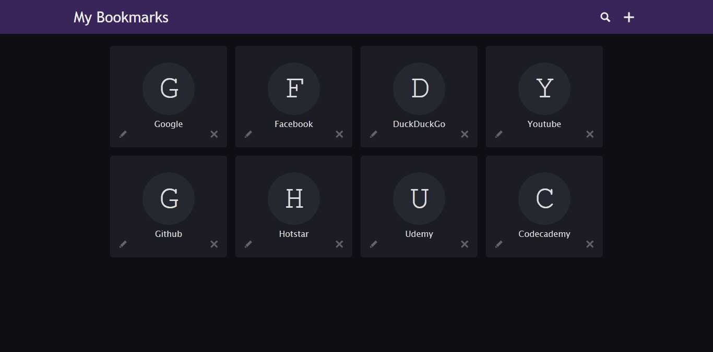
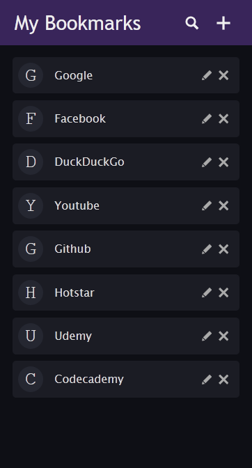
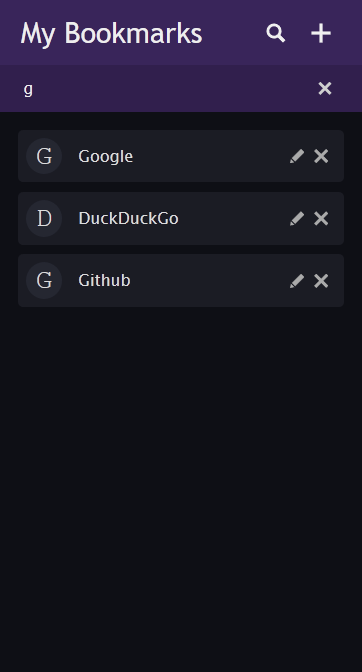
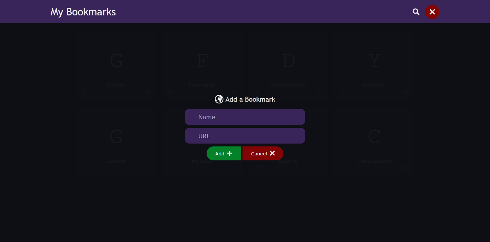

# bookmarker-js
Bookmarker Tool with JS and HTML5 Local Storage

## Current Implementations
1. Addition and Deletion of Bookmarks
2. Material Design
3. Responsive for all devices
4. Permanent Storage in HTML5 Local Storage
5. Search Options
5. Store is JSON format

## Screenshots
   

## Support
* Feel free to Modify and Update this project
* Please let me know if something needs to be improved
* Edit Functionality will be implemented soon
* Thank you!
